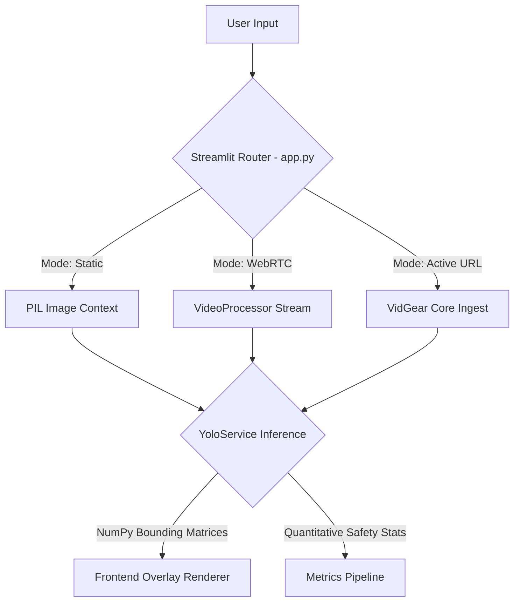

# Architecture Specification

This document details the software architecture underlying the GEAR AI framework. 

## 1. High-Level System Architecture

The overarching system operates on a unified micro-layer architecture hosted inside a single robust Streamlit process. Due to performance constraints introduced by computer vision pipelines, the separation of frontend rendering and backend inference heavily depends on Python execution threads and memory caching.

### Structural Flow

## 2. Core Service Abstractions

### `YoloService` (`services/yolo_service.py`)
Encapsulates the raw PyTorch operations into a deterministic Object-Oriented wrapper.
- **Initialization:** Strictly single-loaded into GPU or MPS (Metal Performance Shaders) cache utilizing Streamlit's `@st.cache_resource` decorators. This prevents repetitive disk I/O when the UI re-renders on widget interaction.
- **Process:** Accepts a standard multi-dimensional NumPy array (`cv2` BGR format) and returns mathematical coordinates alongside human-readable metric dictionaries.

### `VideoProcessor` (`services/video_processor.py`)
Orchestrates the asynchronous logic demanded by the `streamlit-webrtc` integration.
- Maintains state trackers outside of the traditional `st.session_state` constraints.
- Dynamically accepts UX interaction variables (Confidence metrics, Style parameters, Privacy controls) injected directly from the Streamlit UI frame into the detached asynchronous WebRTC processing thread.
- Employs debouncing thresholds (e.g., verifying a worker is missing a hardhat for several continuous seconds) to eliminate statistical false positives from jittery object tracking.

### Streamlit DOM Manipulation (`app.py`)
The architectural frontend transcends traditional Streamlit structures by bypassing default wrappers to inject customized CSS Keyframes and styling structures.
- **Normalized Geometry:** All incoming data nodes (WebRTC and VidGear arrays) are flattened exactly to an `854x480` (16:9 widescreen) mathematical projection before drawing bounding layers.
- **Asynchronous Log Rendering:** Detected violations trigger the `generate_log_html()` helper function, which embeds Base64 encoded NumPy array visual crops natively into Keyframe-animated HTML elements.

## 3. Data Processing Paradigms

1. **Resolution Constraints:** Web streaming (specifically YouTube extraction) is locked to a 480p boundary layer. Down-scaling the active feed guarantees high frame-rates and keeps the inference latency well beneath standard human perception intervals.
2. **Memory Overrides:** The architecture uses `cv2.addWeighted` for computationally inexpensive geometric overlays, drastically out-performing pixel-by-pixel mutations common in amateur CV frameworks.

## 4. Hardware and Dependency Isolation

- **Docker Ready:** The environment structure separates transient files (`__pycache__`, local dataset directories) structurally via `.` ignores, paving a clear track for containerization and Kubernetes cluster deployment.
- **Multi-Threading:** Real-time analytics heavily depend on the separation of the main event loop and the native hardware frame ingestion loops. Blocking the main thread crashes the UI; the architecture respects this via distinct handler classes.

## 5. Dataset Architecture & Model Selection

### Proprietary Image Matricies
The model is trained on an internal dataset rigorously audited for complex industrial topography.
- **Splits:** Train (2,416), Val (277), Test (84)
- **Mapping Protocol:** 10-class hierarchy (`0`: Hardhat, `1`: Mask, `2`: NO-Hardhat, `3`: NO-Mask, `4`: NO-Safety Vest, `5`: Person, `6`: Safety Cone, `7`: Safety Vest, `8`: Machinery, `9`: Vehicle).
- **Data Integrity:** Any augmented images must strictly follow the YOLOv8 flat `.txt` bounding formats (0.0 - 1.0 normalization) to prevent inference degradation. External cloud storage of this directory is restricted.

### Algorithm Evaluation
- **YOLOv6:** Evaluated for low-latency but discarded due to degradation on small objects (e.g., masks) under distance.
- **RT-DETR:** Transformer-based spatial accuracy was excellent, but inference latency regularly exceeded ~30ms locally, violating our real-time streaming constraints.
- **YOLOv8 (Selected):** Achieved the perfect synthesis of sub-12ms processing times and aggressive anchor-free detection, natively scaling efficiently inside our `services/yolo_service.py` architecture.
