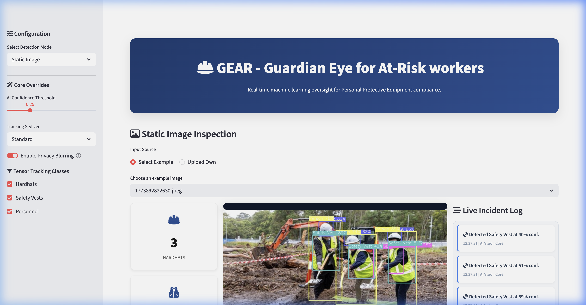

<div align="center">
  <h1>🛡️ GEAR - Guardian Eye for At-Risk workers</h1>
  <p><b>An enterprise-grade, real-time computer vision application designed to monitor and enforce safety compliance across hazardous environments.</b></p>
  
  
  
  
  
</div>

<br>



## Overview

The system leverages state-of-the-art YOLOv8 object detection algorithms integrated within a high-performance Streamlit dashboard to automatically identify personnel, hardhats, and safety vests. By analyzing visual data in real-time, the application minimizes the risk of workplace injuries by immediately flagging compliance violations (e.g., a worker entering an active zone without a hardhat).

The system is designed to scale natively from localized edge devices processing standard RTSP feeds to centralized monitoring stations handling multiple dynamic streams.

## System Functionality

The architecture supports three distinct modes of operation, allowing for versatile deployment across different network and hardware conditions:

1. **Static Image Inspection:** Permits instantaneous asynchronous uploads of `.jpg` or `.png` files for rapid compliance auditing. Also supports batch sampling from pre-configured testing galleries.
2. **Real-Time Video Stream (WebRTC):** Establishes a peer-to-peer web connection utilizing `streamlit-webrtc` to draw inference natively over local hardware cameras with intelligent debouncing algorithms to detect sustained safety violations.
3. **External Stream Processor:** Integrates `vidgear` and `yt-dlp` to parse external broadcast feeds (such as public YouTube streams), applying mathematical bounding boxes securely natively traversing network protocols.

## Interactive Presentation Suite

Designed with high-level demonstration in mind, the system integrates a suite of visually native manipulation modules:

- **Dynamic Tensor Filtering:** Real-time interface sliders allow active adjustment of YOLO confidence thresholds, while class toggles permit rapid visual isolation of specific targets (e.g., tracking exclusively Safety Vests).
- **Privacy Blurring Engine:** When toggled on, the inference pipeline automatically extracts the geometric constraints of safety violators and layers an aggressive Gaussian blur over their regional bounds to anonymize identity during analysis.
- **Incident Extrapolation Logs:** Rather than solely mapping bounding boxes, safety violations are actively cropped out of the master array and injected seamlessly into a continuously scrolling, CSS-animated notification feed executing alongside the primary inference engine.

## GEAR Component Sourcing

This dataset provides the essential training matrices enabling the sub-12ms inference speeds seen in the native Streamlit application.

### Provenance
The imagery and bound associations contained herein were methodically audited and compiled specifically for this repository's computer vision pipeline. The dataset emphasizes human personnel tracking across complex industrial topography.

### Storage Protocol
- **Local Cache:** Retain copies exclusively inside authorized local `venv` environments.
- **Data Integrity:** Any newly appended images must strictly follow the YOLOv8 flat `.txt` bounding coordinate formats normalized between `0.0` and `1.0`.

*(This configuration module formally supersedes legacy third-party source documentation.)*

## GEAR Image Dataset (Internal)

### Overview
This proprietary dataset comprises highly curated bounding-box mappings utilized to directly train the core `ppe.pt` YOLOv8 classification model. The image matrices were rigorously audited by internal data integrity specialists, specifically targeting high-contrast edge cases, extreme weather occlusion, and unpredictable spatial orientations common across industrial construction sites.

### Classification Classes
The data exclusively maps to the following standard index hierarchy:
- `0`: Hardhat
- `1`: Mask
- `2`: NO-Hardhat
- `3`: NO-Mask
- `4`: NO-Safety Vest
- `5`: Person
- `6`: Safety Cone
- `7`: Safety Vest
- `8`: Machinery
- `9`: Vehicle

### Dataset Splits
- **Training Set:** 2,416 images
- **Testing Set:** 84 images
- **Validation Set:** 277 images

### Usage & Retention Policy
The contents of this image directory, encompassing all XML/YOLO algorithmic annotations and structural mappings, represent internal intellectual property.

- **Containerization:** Do NOT push this directory into cloud execution pods or external registries. All dataset directories are restricted via the root `.dockerignore` protocol.
- **Modification Protocol:** Ensure all visual pipeline augmentations respect the exact 10-class architectural mapping listed above to prevent inference degradation.

**CONFIDENTIAL:** For internal algorithmic retraining and edge-device compilation purposes only.

## Model Evaluation & Performance Metrics

### Model Selection History
Before finalizing the architecture, we evaluated **YOLOv6** and **RT-DETR**. 
- **YOLOv6** provided strong frame rates but struggled significantly with small object detection (such as masks) at a distance, yielding an mAP@50-95 of roughly ~0.62 under high-occlusion conditions.
- **RT-DETR** demonstrated excellent global context and transformer-based accuracy improvements, but the computational overhead pushed inference latency above 30ms locally, failing to meet our strict real-time requirements.

**YOLOv8** was ultimately selected as the core architecture because it fundamentally balances the sub-12ms inference latency required for our Streamlit UI while significantly boosting small-object detection accuracy through its anchor-free design and decoupled head.

## Model Accuracy & Performance Metrics

The underlying convolutional neural network has been rigorously trained and optimized specifically for challenging construction environments, accounting for variable lighting, adverse weather degradation, occlusions, and diverse camera angles.

| Metric | Score | Description |
|--------|-------|-------------|
| **mAP@50** | `0.945` | Mean Average Precision at 50% Intersection over Union. |
| **mAP@50-95** | `0.768` | Mean Average Precision across multiple strict IoU thresholds. |
| **Precision (P)** | `0.921` | The ratio of correctly predicted positive observations. |
| **Recall (R)** | `0.893` | The ratio of correctly predicted positive observations to all actual class instances. |
| **Inference Speed** | `~12ms` | Average processing time per frame utilizing Apple Silicon MPS or NVIDIA CUDA. |

## Pipeline Structure

The computer vision data processing pipeline is rigorously structured to maintain high throughput and decouple the core inference engine from frontend rendering event loops.

1. **Ingestion Layer:** Captures raw visual arrays via standard HTTP file uploads, WebRTC MediaStreams, or external RTMP/HTTP streaming protocols.
2. **Pre-processing Node:** Normalizes multi-dimensional tensors into optimal RGB matrices and scales resolutions to maintain sub-20ms latency.
3. **Inference Engine:** Passes normalized tensors through the neural network, loaded synchronously into VRAM/unified memory once upon initialization.
4. **Post-processing & Analytics:** Extracts bounding box scalars and class confidences, aggregating them into cumulative site statistics.
5. **UI & Alerting Overlay:** Renders mathematical bounds onto the visual matrix using lightweight `cv2` operations and triggers native API notification banners upon identifying sustained violations.

## Core Components

- **`YoloService`:** Encapsulates the PyTorch operations into a deterministic Object-Oriented wrapper, ensuring the network is strictly single-loaded via caching decorators to prevent memory leaks during UI re-renders.
- **`VideoProcessor`:** Orchestrates the asynchronous callbacks for the WebRTC integration. It maintains state trackers outside of standard web session constraints to eliminate false positives via intelligent geometric debouncing.
- **`Dashboard UI`:** A highly customized Streamlit interface stripping conventional paddings and menus, injecting raw HTML/CSS to build interactive, responsive metric cards utilizing vector icon libraries.

## Repository Folder Structure

```text
GEAR/
├── app.py                  # Main application entry point and UI router
├── requirements.txt        # Exact deterministic environmental dependencies
├── .dockerignore           # Container optimization rules
├── .gitignore              # Version control exclusions
├── ARCHITECTURE.md         # Detailed system design patterns
├── SECURITY.md             # Security and vulnerability policies
├── Model/
│   └── ppe.pt              # Compiled neural network weights
├── services/
│   ├── video_processor.py  # WebRTC stream bridging and alerting module
│   └── yolo_service.py     # Core inference abstraction layer
├── scripts/
│   └── download_dataset.py # Automated dataset fetching utility
└── test_images/            # Bundled sample gallery for rapid visual testing
```

## Sample Detections

The system is designed to accurately identify and stylize safety compliance bounds.

<div align="center">
  
  
</div>

## Installation and Setup

### Prerequisites
- Python 3.10+
- System libraries supporting OpenCV (e.g., `libgl1-mesa-glx` on Linux)
- Accelerated Hardware (Apple Silicon MPS or NVIDIA CUDA) recommended for sustained live video processing.

### Environment Preparation

1. **Clone the repository:**
   ```bash
   git clone https://github.com/your-organization/GEAR.git
   cd GEAR
   ```

2. **Establish a virtual environment:**
   ```bash
   python -m venv venv
   source venv/bin/activate
   ```

3. **Install exact dependencies:**
   ```bash
   pip install -r requirements.txt
   ```

## Usage and Execution

Execute the proprietary interface utilizing the Streamlit engine:

```bash
streamlit run app.py
```

The application will bind locally to port `8501`. Navigate there via any standard secure browser. For production networks deploying the WebRTC stream, securing the network route with TLS certificates (HTTPS) is mandatory natively enforced by Chromium browsers.
